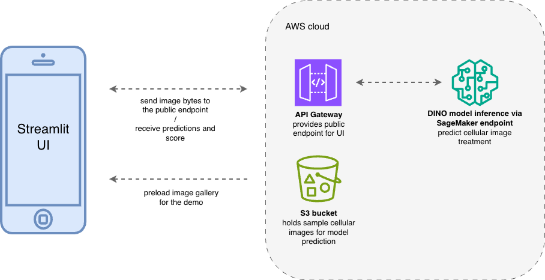

### 🔬 Cell-DINO: End-to-End Cellular Image Classification
Live Demo Page | Architecture Overview

A production-grade MLOps platform for classifying cellular images using DINO-based features, deployed on AWS with a fully automated CI/CD pipeline.

#### System Architecture 

**Frontend:** Streamlit (hosted on Streamlit Cloud).

**Model Inference:** SageMaker Endpoints (PyTorch/DINO).

**API Layer:** AWS API Gateway with direct SageMaker invocation.

**Infrastructure:** Terraform (using Workspaces for Environment Isolation).

**CI/CD:** GitHub Actions (Automated Docker builds to ECR & Terraform Apply).

**Architecture diagram:**




#### Key Engineering Features

**Multi-Environment Deployment:** Managed separate QA and Production environments using Terraform Workspaces and Git branching strategies.

**Optimised Inference:** Cost-Optimised Serverless Architecture and S3-backed gallery for low-latency user experience.

**Cloud-Native Security:** Secured AWS credentials using GitHub Secrets and scoped IAM policies (Least Privilege).

**Automated Containerization:** Built custom Docker images optimized for SageMaker inference, managed via Amazon ECR.


#### Project Structure

```bash
.
├── .github/workflows/  # CI/CD Pipeline
├── src/                # Model logic & Inference scripts
├── terraform/          # Infrastructure as Code (Workspaces: QA/Prod)
├── ui/                 # Streamlit Application
└── weights/            # Model artifacts (managed via Git LFS)
```

####  Future Roadmap 

- Implement automated model evaluation gates in CI/CD.
- Add CloudWatch dashboards for inference monitoring.
- Integration of A/B testing for model variants.
